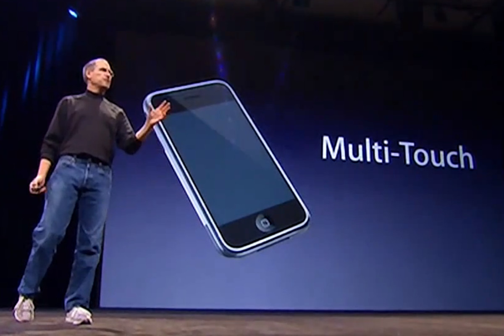
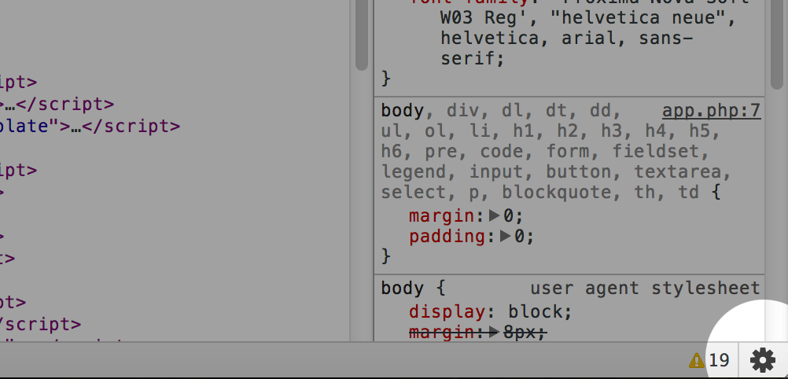
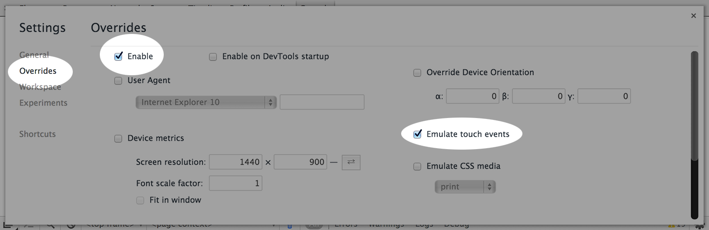

# Multi-Touch Web Development

## Началото на Multi-Touch



През голяма част от съществуването си основния начин за работа с компютрите е чрез мишка и клавиатура. Но през последното десетилетие iPhone-a промени всичко. През 2007 година Стив Джобс обяви оригиналния iPhone. Той поддържа така наречения multi-touch интеракция с дисплея. Не много по-късно с излизането на Mobile Safari 2.0 се добавя и възможността за обработка на много засечени точки по дисплея от едно уеб приложение. След това почти всеки дръг производител видя потенцияла на тази технология и я вгради в свойте устроиства. Така се зароди и новия начин за интеракция с устройствата - touch. Днес списъка от устройства включва смартфони, таблети а дори и лаптопи и настолни компютри. Това създава допълнителни трудности на рабработчиците на уеб приложения. Out of the box интеграцията на браузърите обработва има базова обработка на няколко touch-a за уголемяване на съдържанието и нагласяне на отместването(scroll). Но за да се отключи пълната мощ на тази технология трябва да трабва всяко уеб приложение да направи интеграция на така наречените touch събития.

## Demo

<iframe style="width:100%;height:400px;" src="https://patrickhlauke.github.io/touch/tracker/multi-touch-tracker-pointer-hud.html"></iframe>

## Touch events
Първообраза на touch събитията се заражда още със пускане то на iPhone под формата на private library използвана за изграждане на вграените в iOS приможения - [UIKit](https://developer.apple.com/documentation/uikit?language=objc). С пускането на първата публична версия на iOS SDK се предоставя достъп и до обектите от тип UIEvent и UITouch. В света на iOS мобилните приложения всеки видим компонент е от тип UIView и получава събития разделени в 4 категории - (touchesBegan, touchesMoved, touchesEnded, touchesCancelled). Още от самото си начало всичко е разработено с мисъл за интеракция с повече от една точка на допир.

В уеб света обаче всичко е организирано около мишката на потребителя. За целта са вкарани и отделни event-и за обработка на събития от тип движение на мишката, натискане на някои от бутони и дори завъртане на колелото.

При пренасянето на събитията в уеб света са вкарани и типове на така наречените [`TouchEvent`](https://developer.mozilla.org/en-US/docs/Web/API/TouchEvent). Те имат следните типове:

* `touchstart` - нова точка е засечена
* `touchmove` - дадена точка си е сменила местоположението
* `touchend` - дадена точка е напуснала екрана
* `touchcancel` - външен ефект е прекъснал взаимодействието на точката със съдържанието
* {--*`touchenter`*--} - точка е навлязла в рамките на елемент
* {--*`touchleave`*--} - точка е напуснала елемент

!!! note
    `touchenter` и `touchleave` са премахнати от стандарта поради липса на поддържка от популярните браузъри

`TouchEvent` съдържа много property-та, но едно от интересните е `touches`. То съдържа всички обекти от тип `Touch`.

`targetTouches` пък връща само обектите които се отнасят за обекта който ни интересува. След началото на следенето на touch-а всички точки на допир ще бъдат връщани, дори и те да не се отнасят за текущия елемент.

Друго полезно property е `changedTouches`, съдържащо само променените точки на допир спрямо последното събитие.

Демо:

<iframe style="width:100%;height:400px;" src="https://patrickhlauke.github.io/touch/touchlist-objects/"></iframe>

## Touch обект
Всеки `Touch` има следните основни property-та:

* `identifier` - уникален идентификатор на touch обекта
* `pageX` - позицията по Х координатата в точки релативни към големината на съдържанието част на уеб страницата(включва отстояния)
* `pageY` - позицията по Y координатата в точки релативни към големината на съдържанието част на уеб страницата(включва отстояния)
* `screenX` - позицията по Х координатата в реални точки(независима от съдържанието от голенимата и съдържанието на уеб страницата)
* `screenY` - позицията по Y координатата в реални точки(независима от съдържанието от голенимата и съдържанието на уеб страницата)
* `clientX` - позицията по Х координатата в точки релативни към големината на видимата част на уеб страницата(независима от отстояния)
* `clientY` - позицията по Y координатата в точки релативни към големината на видимата част на уеб страницата(независима от отстояния)
* `target` - елемента на страницата който първоначално е бил докоснат

!!! tip
    Най-често се използват `pageX` и `pageY` понеже те взимат под внимание отстояния менюта на браузъра и отместването спрямо началото на съдържанието

TODO: _insert image showing the different client page and screen X/Y_

## Default browser behavior
По подразбиране браузърите обработват единични докосвания като събития от мишка. Тоест при единично натискане и премахване от екрана се генерира `click` събитие въпреки че в идеологията на touch екраните няма кликане. Това става като при получаване на `touchend` събитие(в случай че движението е достатъчно малко за да се интерпретира като клик), браузъра генерира следните събития в точно този ред: `mousemove`, `mousedown`, `mouseup`, `click`. Ако пък движението е минава границата за да бъде отчетено като клик, то браузъра започва на наглася отместването на съдържанието. Има и много други поведения който браузъра симулира, за да поддържа съвмистимост със стари уеб приложения.

!!! note
    При симулиране на `click` браузъра изчаква около 300ms преди да изпрати събитието за да може да засече допълнителни действия от потребителя и да го обработи по различен начин. Например double click се обработва като увеличение на съдържанието и не изпраща `click` събитие към елементите.


## Blocking default browser Zoom
За да запази съвместимост с уеб приможения разработени за екрани на настолни компютри, мобилните браузъри зареждат страницата с размери различни от тези на текущото устройство. А както споменахме преди малко използват и double tap за да уголемяване/намаляване на размера на съдържанието. Това поведение може да се променя като се използва `<meta>` тага.

``` html
<meta name="viewport"
      content="width=device-width, initial-scale=1.0, user-scalable=no">
```

Със добавяне на показания `<meta>` таг напълно се изключва корекцията на големината на съдържанието чрез използване на жестове. Това означава че браузъра няма да засича и обработва double tap и pinch.


!!! info
    При използване на `<meta name="viewport" content="width=device-width" >` се премахва забавянето от 300 ms, понеже браузъра засича страницата като опримизиране за мобилни устроиства и изключва double tap за увеличение на съдържанието.


## Blocking default browser Scroll
Често обаче изключване на zoom функционалностите не е достатъчно. При използване на така наречения pan gesture, браузъра отместването съдържанието.

Възможните опции са различни в завидимост от големината на областта в която обработваме touch-ове.

### Цял екран

Подобно на `width` аттрибута на meta viewport, може да се използва и height.

``` html
<meta name="viewport"
      content="... height=device-height" >
```

Това решение е добро ако искаме областта в която ще обработваме touch събития да е с големина точно колкото екрана. Това означава че ако има нужда ще трябва и сами да имплементираме отместване на съдържанието, при необходимост.

### Част от екрана
Ако искаме само дадена област от съдържанието да обработва touch event-и а останалото съдържание да си поддържа scroll, трябва да се използва `preventDefault()`.

``` javascript
function touchHandler(event) {
    event.preventDefault();
    // ...
}
```

При използване на `preventDefault()` не е задължително да се използва meta viewport. Добрата практика е да се извиква на `touchstart`, `touchmove` и `touchend`. `touchcancel` няма default поведение и извикване върху него няма да има страничен ефект.

!!! note
    Извикване на `preventDefault()` ще елиминира и генерирането на mouse & click event-и.

## Rendering
Честотата на обновяване и изпращане на `touchstart`, `touchmove`, `touchend` не е точно дефинирана. За да се минимизира процесорното време в изчисление на UI, се пропоръчва да се запаметяват обновените стойности получени промяна на touch-овете и да се извиква `requestAnimationFrame(...)`. Така много лесно се постига стабилен frame-rate, без да се вкарва сложна логика за следене на честотата на обновяване.
Дори и да се получат 2-3 или повече нови стойности от `touchmove`, `requestAnimationFrame(...)` ще се погрижи да извика функцията за обновяване на UI в подходящия момент и ще игнорира всички освен последното поискване.

## Тouch vs Mouse precision
Поради своятасъщност елементите които приемат touch събития трябва да са по-големи, сравнено с идентични такива които приемат събития от мишка. Те имат и минимален препоръчителен размер 44х44 points. Това правило важи и за Multi-Touch приможения като се има предвид че ако се избере минималния размер само една точка ще може да се събере в очертанията му. Но е напълно възможно само първата точка да трябва да е в очертанието на даден обект а допълнителни точки да са извън него. `Touch` обекта предоставя и `radiusX`, `radiusY`, `rotationAngle` които описват точната големина на всяка от точките на допир с екрана.

!!! info
    44 points x 44 points е препоръчителния размер от Apple посочен в [Human Interface Guidelines](https://developer.apple.com/design/human-interface-guidelines/ios/visual-design/adaptivity-and-layout/) при гъстота 163 ppi(points per inch).

    44 points ~ 0,27 inch(0,686 см)


## Desktop support(simulation)
Поддръжка на touch event-и в текущия браузър:

<iframe style="height:300px;" src="https://patrickhlauke.github.io/touch/tests/touch-feature-detect.html"></iframe>

Тестването на уеб приложения на мобилно устройство прави разработката занчително по трудна. Поради това Chrome има вградена фунцкционалност за емулиране на touch събития чрез използване на мишка.



През последните години се появиха и лаптопи и монитори с touch панели. Те също биха могли да се използват за разработка на уеб приложения, на може и за изискват инвестиция в нов хардуер, защото още не са прекалено масови.

## [`GestureEvent`](https://developer.apple.com/documentation/webkitjs/gestureevent)

От зараждането си на iOS Multi-Touch е имал лесна интеграция на популярните pinch & rotate жестове. Те имат и уеб интерфейс наречен `GestureEvent`.

Този event има и лесни за използване property-та `rotation` и `scale`, които връщат стойността на засеченото завъртане и увеличение спрямо първоначалното състояние.

!!! Warning
    Тази фунцкционалност още не е стандартизирана и се поддържа единствено от Safari.

Демо показващо rotate & scale(iOS only):

<iframe style="height:500px;width:100%;" src="https://patrickhlauke.github.io/touch/iosgestures/image.html"></iframe>

## Използвани ресурси
TODO: _format links_

1. https://developer.apple.com/documentation/webkitjs/touchevent
1. https://www.html5rocks.com/en/mobile/touchandmouse/
1. https://www.html5rocks.com/en/mobile/touch/
1. https://blog.teamtreehouse.com/building-multi-touch-web-applications
1. https://developer.mozilla.org/en-US/docs/Web/API/Touch_events
1. https://developer.mozilla.org/en-US/docs/Web/API/UIEvent
1. https://www.w3.org/TR/2013/REC-touch-events-20131010/#dfn-preventdefault
1. https://developer.apple.com/design/tips/

1. https://developers.google.com/web/updates/2013/12/300ms-tap-delay-gone-away
1. https://patrickhlauke.github.io/touch/
1. https://developer.apple.com/documentation/webkitjs/gestureevent


## Използвани термини и съкращения
TODO: _extract all english words_

## Списък с фигури
TODO: _add fancy images_


TODO: _fix links on `marked` words_
